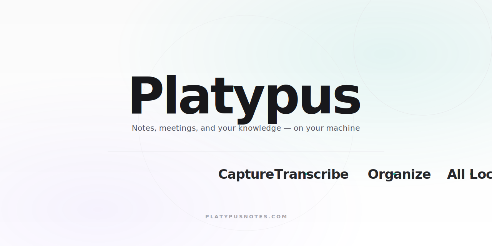

<p align="center">
  
</p>

# Platypus Notes

An open-source desktop app for taking notes, transcribing meetings, and chatting with your documents. Runs entirely on your machine — the only network calls are to whichever LLM you choose to connect, and only when you ask a question.

[**Download for macOS**](https://the-platypus-app.s3.amazonaws.com/PlatypusNotes-latest.dmg) · [platypusnotes.com](https://platypusnotes.com) · MIT license

<video src="https://github.com/user-attachments/assets/e034862a-0def-4b75-a133-d850d191d82a" autoplay loop muted playsinline></video>

## What it does

- **Capture meetings** — auto-detects Zoom and Teams calls; transcribes locally via Whisper or via OpenAI's API
- **Organize notes and documents** — rich editor with PDF/DOCX/TXT import, project grouping, and AI-assisted polish
- **Chat with everything you've written** — per-project HNSW vector search, with Claude, OpenAI, Gemini, or any local Ollama model
- **Generate from any note** — turn a meeting transcript or document into structured meeting notes, a slide deck, or an audio podcast (via ElevenLabs)

Data stays on disk in SQLite. In local transcription mode, audio never leaves your machine.

## How it compares

|                              | Platypus    | Granola | NotebookLM | Otter.ai |
| ---------------------------- | ----------- | ------- | ---------- | -------- |
| Stores data on your machine  | ✅          | ❌      | ❌         | ❌       |
| Meeting transcription        | ✅          | ✅      | ❌         | ✅       |
| RAG over your notes/docs     | ✅          | partial | ✅         | ❌       |
| Bring your own LLM           | ✅          | ❌      | ❌         | ❌       |
| Open source                  | ✅          | ❌      | ❌         | ❌       |
| Free                         | ✅          | partial | partial    | ❌       |
| Native desktop               | ✅          | ✅      | ❌         | ❌       |

## Voice transcription

Two modes, switchable in Settings.

**Local Whisper (default)** — on-device transcription via whisper.cpp.

- Real-time: live transcript streams during recording
- Works offline, no API key required
- Hardware-accelerated via Metal on macOS, CPU fallback elsewhere
- Models (selectable in Settings): Large v3 (~3.1GB, default, best quality), Large v3 Turbo (~1.6GB), Distil Large v3.5 (~1.5GB, fastest)
- Model auto-downloads on first use

**OpenAI API** — records WAV, uploads to OpenAI's Whisper endpoint.

- Requires an OpenAI API key
- Transcribes after recording finishes (not real-time)

## Tech stack

| Layer            | Technology                                                                        |
| ---------------- | --------------------------------------------------------------------------------- |
| Desktop shell    | Tauri v1 (1.5.2)                                                                  |
| Backend          | Rust                                                                              |
| Frontend         | React + TypeScript + Vite                                                         |
| UI               | Chakra UI + styled-components                                                     |
| Editor           | TipTap                                                                            |
| AI providers     | Claude, OpenAI, Gemini, Ollama                                                    |
| Transcription    | whisper-rs v0.16 (local) / OpenAI Whisper API (cloud)                             |
| Audio            | CPAL (recording), nnnoiseless (denoising), rubato (resampling)                    |
| Database         | SQLite (rusqlite)                                                                 |
| Vector search    | HNSW (hnswlib-rs)                                                                 |

## Build from source

### Requirements

- Node 18+ (recommended via [nvm](https://github.com/nvm-sh/nvm))
- [Rust](https://www.rust-lang.org/tools/install)
- **cmake** — required by `whisper-rs-sys` to compile whisper.cpp
  - macOS: `brew install cmake`
  - Windows: `winget install Kitware.CMake`
- **LLVM / libclang** (Windows only — required by `bindgen` when building `whisper-rs-sys`; macOS ships this via Xcode Command Line Tools)
  - `winget install LLVM.LLVM`
  - Then set `LIBCLANG_PATH` so `bindgen` can find `libclang.dll`:
    ```
    setx LIBCLANG_PATH "C:\Program Files\LLVM\bin"
    ```
    Open a new terminal afterward so the env var is picked up.

### Run in dev

```bash
npm install
npm run tauri dev
```

If you hit dependency issues, delete `package-lock.json` and re-run `npm install`.

Add your LLM API keys in Settings before use.

### Build a release

```bash
npm install
npm run tauri build
```

For a signed + notarized macOS build that uploads to your S3 bucket, see [`scripts/build-mac.sh`](scripts/build-mac.sh) — requires Apple Developer credentials in `.env.build`.

## Architecture notes

A few of the less-obvious decisions:

- **Audio pipeline**: CPAL capture → energy-based VAD on raw samples → nnnoiseless denoising at 48kHz → rubato resample to 16kHz → whisper.cpp via [whisper-rs](https://github.com/tazz4843/whisper-rs). VAD runs *before* denoise because RNNoise crushes signal amplitude ~100x and every chunk would otherwise look silent.
- **Meeting detection**: Zoom is detected by presence of the `CptHost` process; Teams by CPU usage on its `audio.mojom.AudioService` sub-process. No Zoom/Teams API access required.
- **Vector search**: per-project HNSW indices ([hnswlib-rs](https://github.com/jean-pierreBoth/hnswlib-rs)); documents chunked and embedded on save when vectorization is enabled.

## Contributing

See [CONTRIBUTING.md](CONTRIBUTING.md).

## Acknowledgments

Platypus stands on the shoulders of:

- [whisper.cpp](https://github.com/ggerganov/whisper.cpp) and [whisper-rs](https://github.com/tazz4843/whisper-rs) — local speech-to-text
- [Distil-Whisper](https://huggingface.co/distil-whisper) by HuggingFace — the distilled Whisper variants
- [nnnoiseless](https://github.com/jneem/nnnoiseless) — pure-Rust port of Mozilla's RNNoise
- [rubato](https://github.com/HEnquist/rubato) — sample-rate conversion
- [hnswlib-rs](https://github.com/jean-pierreBoth/hnswlib-rs) — HNSW vector index

## License

MIT.
