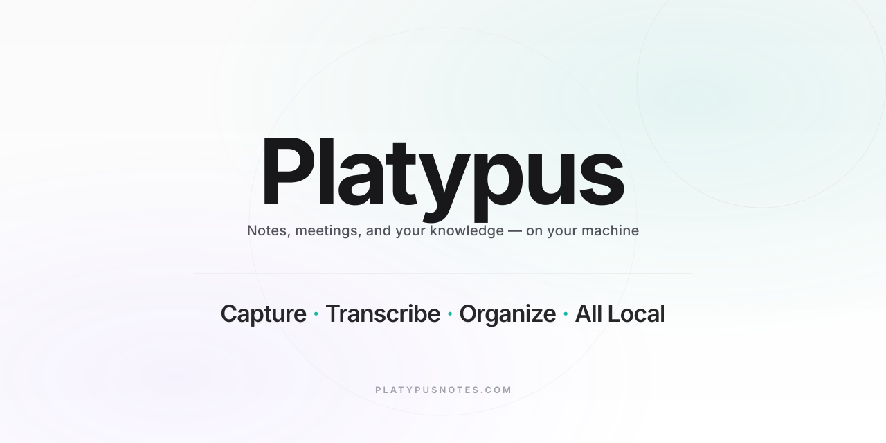

<p align="center">
  
</p>

# Platypus Notes

An open-source desktop app for taking notes, transcribing meetings, and chatting with your documents. Your notes stay on your machine, and AI runs on whichever provider you connect — or fully local with Whisper and Ollama.

[**Download for macOS**](https://the-platypus-app.s3.amazonaws.com/PlatypusNotes-latest.dmg) · [platypusnotes.com](https://platypusnotes.com) · MIT license

<video src="https://github.com/user-attachments/assets/e034862a-0def-4b75-a133-d850d191d82a" autoplay loop muted playsinline></video>

## What it does

- **Capture meetings** — auto-detects Zoom and Teams calls and records your mic plus the meeting audio, no bot required; transcribes locally via Whisper with live drafts as people speak, or via OpenAI's API
- **Organize meeting notes** — combine your rough notes with the transcript into notes built around what you flagged: decisions, next steps, and open questions
- **Clean up any note** — tidy, shorten, or reorganize; compare with the original before applying, and undo in one step
- **Organize notes and documents** — rich editor with PDF/DOCX/TXT/Markdown and URL import, project grouping, and content search you can browse from the keyboard
- **Chat with everything you've written** — per-project vector search with Claude, OpenAI, Gemini, or any local Ollama model. Answers are grounded in your notes with inline `[n]` citations you can click to jump to the source passage, and each project greets you with suggested questions generated from its content
- **Generate from any note** — a PowerPoint deck with editable charts and tables, a follow-up email, or an audio podcast (via ElevenLabs). Decks build in the background while you keep working

Data stays on disk in SQLite. In local transcription mode, audio never leaves your machine.

## How it compares

|                              | Platypus    | Granola | NotebookLM | Otter.ai |
| ---------------------------- | ----------- | ------- | ---------- | -------- |
| Stores data on your machine  | ✅          | ❌      | ❌         | ❌       |
| Meeting transcription        | ✅          | ✅      | ❌         | ✅       |
| RAG over your notes/docs     | ✅          | partial | ✅         | ❌       |
| Bring your own LLM           | ✅          | ❌      | ❌         | ❌       |
| Open source                  | ✅          | ❌      | ❌         | ❌       |
| Free                         | ✅          | partial | partial    | ❌       |
| Native desktop               | ✅          | ✅      | ❌         | ❌       |

## Voice transcription

**Recording** captures your microphone and the meeting audio together (macOS 13+), or either one alone from the arrow beside **Record**.

- Meeting audio comes straight from your Mac via ScreenCaptureKit, even with headphones — no meeting bot, no video
- Audio isn't kept unless you turn on **Settings → Keep recordings** for playback and model comparisons; failed transcriptions keep their audio so you can retry
- Use headphones when capturing both: echo cancellation isn't implemented yet
- Needs macOS's Screen & System Audio Recording permission; Windows records the microphone only

More in [how meeting audio capture works](docs/meeting-audio.md).

Transcription runs in one of two modes, switchable in Settings.

**Local Whisper (default)** — on-device transcription via whisper.cpp.

- Real-time: live drafts appear as you speak, replaced by a more accurate pass at each pause (only the final pass is saved)
- Model downloads on first use; after that it works offline, no API key required
- Hardware-accelerated via Metal on macOS, CPU fallback elsewhere
- Models (selectable in Settings): Large v3 (~3.1GB, default, best quality), Large v3 Turbo (~1.6GB), Distil Large v3.5 (~1.5GB, fastest)

**OpenAI API** — records WAV, uploads to OpenAI's Whisper endpoint.

- Requires an OpenAI API key
- Transcribes after recording finishes (not real-time)

## Slide decks

Open **Generate from this note → Slide deck**, pick an audience, purpose, and length (2–15 slides), and keep working. The deck saves automatically, you get a notification when it's ready, and past decks live under **Presentations**.

- **Designed PowerPoint** (default for OpenAI models) — the model builds the `.pptx` itself, with native charts, comparison tables, and speaker notes you can edit in PowerPoint or Keynote. Takes a few minutes; uses OpenAI's Code Interpreter, billed to your API key.
- **Simple slides** (any provider) — structured slides that Platypus lays out. Edit, reorder, and export to PowerPoint or Marp Markdown. Usually faster.

See [how the two compare on a real earnings release](docs/presentation-quality.md).

## Models

| Provider   | Built-in choices                         |
| ---------- | ---------------------------------------- |
| Claude     | Sonnet 5 (default), Haiku 4.5, Opus 4.6  |
| OpenAI     | GPT-6 Astra (default), Sol, Luna         |
| Google     | Gemini 3 Pro preview                     |
| Local      | Ollama (Llama 3.3 70B by default)        |

Add API keys in Settings; custom Claude and OpenAI model IDs work too. For models that support it, reasoning effort (from Off/Low up to Max) is remembered per model across chat and generation.

No OpenAI key? **Sign in with ChatGPT** in Settings to run OpenAI chat and note features on your ChatGPT plan. Document indexing, cloud transcription, and designed PowerPoints still need an API key.

## Tech stack

| Layer            | Technology                                                                        |
| ---------------- | --------------------------------------------------------------------------------- |
| Desktop shell    | Tauri v1 (1.5.2)                                                                  |
| Backend          | Rust                                                                              |
| Frontend         | React + TypeScript + Vite                                                         |
| UI               | Chakra UI + styled-components                                                     |
| Editor           | TipTap                                                                            |
| AI providers     | Claude, OpenAI, Gemini, Ollama                                                    |
| Transcription    | whisper-rs v0.16 (local) / OpenAI Whisper API (cloud)                             |
| Audio            | CPAL (microphone), ScreenCaptureKit (macOS meeting audio), rubato (resampling)    |
| Database         | SQLite (rusqlite)                                                                 |
| Vector search    | HNSW (hnswlib-rs)                                                                 |
| Presentations    | OpenAI Responses + Code Interpreter (designed decks); PptxGenJS (simple decks)    |

## Build from source

### Requirements

- Node 18+ (recommended via [nvm](https://github.com/nvm-sh/nvm))
- Yarn on your PATH — the Tauri hooks run `yarn start` and `yarn build`
- [Rust](https://www.rust-lang.org/tools/install)
- **cmake** — required by `whisper-rs-sys` to compile whisper.cpp
  - macOS: `brew install cmake`
  - Windows: `winget install Kitware.CMake`
- **LLVM / libclang** (Windows only — required by `bindgen` when building `whisper-rs-sys`; macOS ships this via Xcode Command Line Tools)
  - `winget install LLVM.LLVM`
  - Then set `LIBCLANG_PATH` so `bindgen` can find `libclang.dll`:
    ```
    setx LIBCLANG_PATH "C:\Program Files\LLVM\bin"
    ```
    Open a new terminal afterward so the env var is picked up.

### Run in dev

```bash
npm install
npm run tauri dev
```

Add your LLM API keys in Settings for cloud AI features. Local notes and Whisper transcription work without any.

### Build a release

```bash
npm install
npm run tauri build
```

For a signed + notarized macOS build that uploads to your S3 bucket, see [`scripts/build-mac.sh`](scripts/build-mac.sh) — requires Apple Developer credentials in `.env.build`.

## Architecture notes

A few of the less-obvious decisions:

- **Audio pipeline**: CPAL microphone and ScreenCaptureKit meeting audio → aligned and mixed on a common 48kHz timeline → near-silence gate that ends an utterance after 700ms of quiet (20s max) → rubato resample to 16kHz → whisper.cpp via [whisper-rs](https://github.com/tazz4843/whisper-rs), with Silero VAD when its model is installed. The gate only skips silence; it isn't a speech classifier, so quiet speech still reaches Whisper.
- **Transcription context**: each chunk is prompted with up to 16 words of recent finalized speech. Drafts, note titles, and vocabulary hints are never used as prompts; in testing, longer history and hints dropped real speech ([details](CONTRIBUTING.md#transcription-quality)).
- **Meeting detection**: Zoom is detected by presence of the `CptHost` process; Teams by CPU usage on its `audio.mojom.AudioService` sub-process. No Zoom/Teams API access required.
- **Vector search**: per-project HNSW indices ([hnswlib-rs](https://github.com/jean-pierreBoth/hnswlib-rs)); documents chunked and embedded on save when vectorization is enabled.
- **Grounded chat with inline citations**: retrieved chunks are numbered `[1]..[n]` in the system prompt, the LLM is instructed to cite every claim and refuse to invent answers, and the same numbering is emitted to the UI so each `[n]` in the response is a clickable chip that opens the supporting passage.
- **Meeting sources**: recordings are stored as a dedicated TipTap transcript node in the note's HTML, so meeting-note organization gets your rough notes and the transcript as separate inputs.
- **Presentation generation**: jobs live at the app level, so they outlive the note editor that started them. The backend downloads, validates, and saves a designed deck's `.pptx` before reporting success. Simple decks are stored as structured slides and share one layout model between preview and PowerPoint export.

## Contributing

See [CONTRIBUTING.md](CONTRIBUTING.md), including the checks to run before opening a PR.

## Acknowledgments

Platypus stands on the shoulders of:

- [whisper.cpp](https://github.com/ggerganov/whisper.cpp) and [whisper-rs](https://github.com/tazz4843/whisper-rs) — local speech-to-text
- [Distil-Whisper](https://huggingface.co/distil-whisper) by HuggingFace — the distilled Whisper variants
- [rubato](https://github.com/HEnquist/rubato) — sample-rate conversion
- [hnswlib-rs](https://github.com/jean-pierreBoth/hnswlib-rs) — HNSW vector index

## License

MIT.
